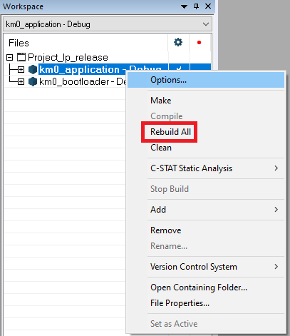
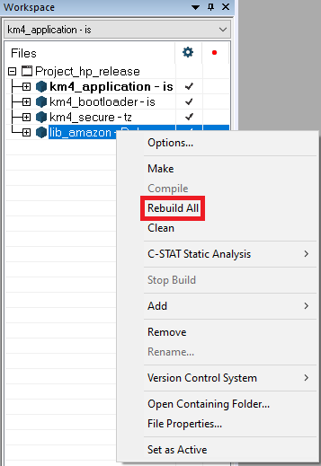
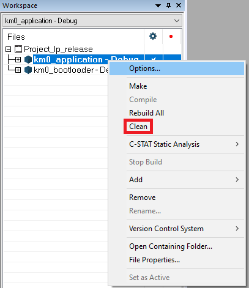
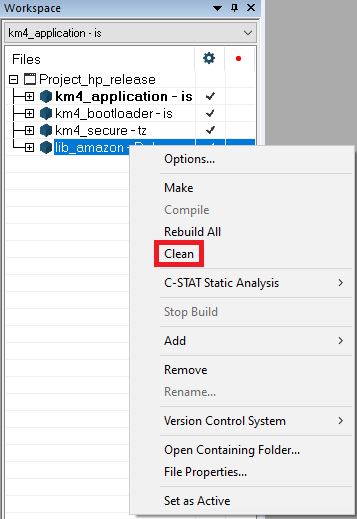

# Amazon FreeRTOS on AmebaD

- [Get Ameba SDK & Amazon FreeRTOS SDK](#get-ameba-sdk--amazon-freertos-sdk)
- [Ameba Amazon FreeRTOS Configuration](#ameba-amazon-freertos-configuration)
- [Build Amazon FreeRTOS Example & Final Firmware](#build-amazon-freertos-example--final-firmware)
- [Flash Image](#flash-image)

## Get Ameba SDK & Amazon FreeRTOS SDK

The current amazon-freertos submodule is working with the following Ameba D SDK and patches:

- sdk-amebad_v6.2C-RC.tar.gz +
- 6.2_patch_integrated_250321_975f3cee.zip +
- 6.2c_patch_Support_Amazon_v202406_LTS_optimized_i250108_r250715_(v01).zip

After applying the patches to the SDK, run the amazon_freertos_setup.sh script for linux

```bash
cd sdk-amebad
chmod u+x amazon_freertos_setup.sh
./amazon_freertos_setup.sh amebad
```

For Windows, run the amazon_freertos_setup.bat

```bat
cd sdk-amebad
amazon_freertos_setup.bat amebad
```

The linux script only clone the ameba-amazon-freertos repo. Meanwhile, the windows script do two actions, cloning ameba-amazon-freertos and patching llhttp.c. The patching is only required for IAR build to remove the error.

## Ameba Amazon FreeRTOS Configuration

### Enable Amazon FreeRTOS Example

#### Makefile

Navigate to the `project_hp` directory:

```bash
cd sdk-amebad/project/realtek_amebaD_va0_example/GCC-RELEASE/project_hp/
```

Enable Amazon FreeRTOS configurations using `menuconfig`
- In the `Amazon FreeRTOS Config` section, select `Enable Amazon FreeRTOS`.
- Under `SSL Config`, In the `MBEDTLS Version`, choose `MBEDTLS_AMAZON_FREERTOS_DEFINED`.

```bash
make menuconfig
```

Do not forget to run `./amazon_freertos_setup.sh amebad` to run the submodules cloning.

#### IAR

All of the IAR files is currently still inside the 6.2c_patch_Support_Amazon_v202406_LTS_optimized_i250108_r250715_(v01).zip patch.

There is no need to change the settings of the IAR project, the patch already override the settings for Amazon FreeRTOS build.

Do not forget to run `amazon_freertos_setup.bat amebad` to run the submodules cloning and source code patching.

### Choosing Amazon FreeRTOS Sub-Example

Navigate to `sdk-amebad/component/common/application/amazon-freertos/ports/amebaD/config_files` directory. To choose which Amazon FreeRTOS sub-example to run, please modify `aws_platform_opts.h`:

```c
// Amazon FreeRTOS SDK sub-example, ONLY ENABLE ONE AT A TIME!!!
#define CONFIG_EXAMPLE_AMAZON_FREERTOS_MQTT_MUTUAL_AUTO         1
#define CONFIG_EXAMPLE_AMAZON_FREERTOS_HTTP_MUTUAL_AUTO         0
#define CONFIG_EXAMPLE_AMAZON_FREERTOS_DEVICE_SHADOW            0
#define CONFIG_EXAMPLE_AMAZON_FREERTOS_DEVICE_DEFENDER          0
#define CONFIG_EXAMPLE_AMAZON_FREERTOS_OTA_OVER_MQTT            0
#define CONFIG_EXAMPLE_AMAZON_FREERTOS_OTA_OVER_MQTT_STREAMS    0
```

If Amazon FreeRTOS OTA example is run, at `ota_demo_config.h`, please update the `otapalconfigCODE_SIGNING_CERTIFICATE`. Please refer more to [AmebaD OTA guide](amebad_ota_guide.md).

### Updating Amazon FreeRTOS Credentials

Please refer to [Amazon FreeRTOS Configuration User Guide](https://docs.aws.amazon.com/freertos/latest/userguide/freertos-configure.html) on setting up the device credentials. After it is configured, navigate to `sdk-amebad/component/common/application/amazon-freertos/demos/include` directory and update the following credential header files:
- at `aws_clientcredential.h`, update the following credentials macros:
    - `clientcredentialMQTT_BROKER_ENDPOINT`
    - `clientcredentialIOT_THING_NAME`
    - `clientcredentialWIFI_SSID`
    - `clientcredentialWIFI_PASSWORD`
- at `aws_clientcredential_keys.h`, update the following credentials macros:
    - `keyCLIENT_CERTIFICATE_PEM`
    - `keyCLIENT_PRIVATE_KEY_PEM`

## Build Amazon FreeRTOS Example & Final Firmware

### Makefile

#### Make project_lp

Navigate to the `project_lp` directory:

```bash
cd sdk-amebad/project/realtek_amebaD_va0_example/GCC-RELEASE/project_lp/
```

Build the `project_lp`:

```bash
make all
```

#### Make project_hp

Ensure the same settings as described in [Ameba Amazon FreeRTOS Configuration](#ameba-amazon-freertos-configuration) and continue navigate to the `project_hp` directory:

```bash
cd sdk-amebad/project/realtek_amebaD_va0_example/GCC-RELEASE/project_hp/
```

Build `project_hp`:

```bash
make all
```

#### Clean Ameba Amazon FreeRTOS libraries and application

Navigate to `project_hp` directory and clean `project_hp`:

```bash
cd sdk-amebad/project/realtek_amebaD_va0_example/GCC-RELEASE/project_hp/
make clean
```

Navigate to `project_lp` directory and clean `project_lp`:

```bash
cd sdk-amebad/project/realtek_amebaD_va0_example/GCC-RELEASE/project_lp/
make clean
```

### IAR

#### Build project_lp

Navigate to `sdk-amebad\project\realtek_amebaD_va0_example\EWARM-RELEASE\`, open `Project_lp_release.eww` with IAR IDE. Navigate to workspace, right click at `km0_application`, choose `Rebuild All`



Do the same for `km0_bootloader`.

#### Build project_hp

Navigate to `sdk-amebad\project\realtek_amebaD_va0_example\EWARM-RELEASE\`, open `Project_hp_release.eww` with IAR IDE. Navigate to workspace, right click at `lib_amazon`, choose `Rebuild All`



Do the same for `km4_application` and `km4_bootloader`.

#### Clean Ameba Amazon FreeRTOS libraries and application

Open `Project_lp_release.eww` with IAR IDE. Navigate to workspace, right click at `km0_application`, choose `Clean`



Do the same for `km0_bootloader`.

Open `Project_hp_release.eww` with IAR IDE. Navigate to workspace, right click at `lib_amazon`, choose `Clean`



Do the same for `km4_application` and `km4_bootloader`.

## Flash Image

Find more details in AN0400 Chapter 8.
